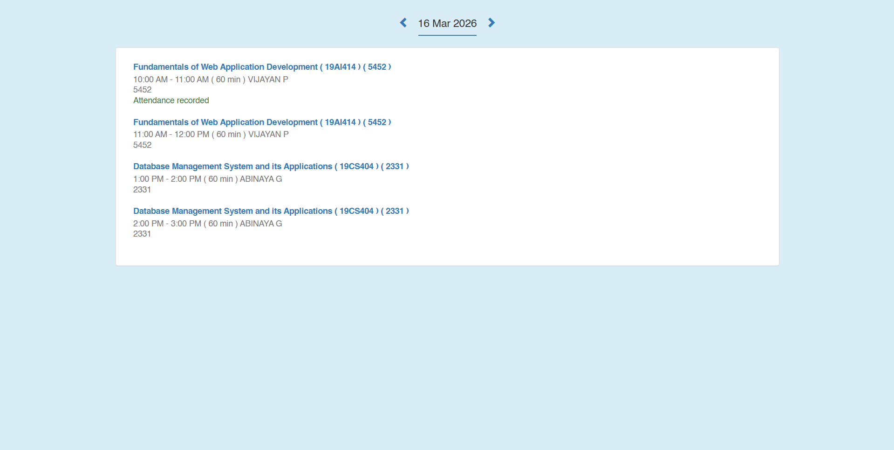

# Ex08 CAMU Schedule using Bootstrap

## Date: 16-03-2026

## AIM:

To design a responsive and visually appealing CAMU Schedule using Bootstrap.

## DESIGN STEPS:

### Step 1:

Clone the repository from GitHub.

### Step 2:

Create Django Admin project.

### Step 3:

Create a New App under the Django Admin project.

### Step 4:

Add the Bootstrap CDN link inside the <head> section.

### Step 5:

Insert a table element with Bootstrap table classes.

### Step 6:

Construct the complete table.

### Step 7:

Add a header/footer displaying copyright information.

### Step 8:

Publish the website in the LocalHost.

## PROGRAM :

```html
<!doctype html>
<html lang="en">
  <head>
    <title>Document</title>
    <meta charset="utf-8" />
    <meta name="viewport" content="width=device-width, initial-scale=1" />

    <link
      rel="stylesheet"
      href="https://maxcdn.bootstrapcdn.com/bootstrap/3.4.1/css/bootstrap.min.css"
    />
    <script src="https://ajax.googleapis.com/ajax/libs/jquery/3.7.1/jquery.min.js"></script>
    <script src="https://maxcdn.bootstrapcdn.com/bootstrap/3.4.1/js/bootstrap.min.js"></script>
  </head>
  <body class="bg-info">
    <div class="container">
      <br />

      <div class="row text-center">
        <div class="col-xs-12">
          <h4>
            <span class="glyphicon glyphicon-chevron-left text-primary"></span>
            &nbsp; 16 Mar 2026 &nbsp;
            <span class="glyphicon glyphicon-chevron-right text-primary"></span>
          </h4>
          <hr
            style="width: 100px; border-top: 2px solid #337ab7; margin-top: 0"
          />
        </div>
      </div>

      <div class="panel panel-default">
        <div class="panel-body">
          <div class="list-group">
            <div
              class="list-group-item"
              style="border: none; border-bottom: 1px solid #eee"
            >
              <h5 class="list-group-item-heading text-primary">
                <strong
                  >Fundamentals of Web Application Development ( 19AI414 ) (
                  5452 )</strong
                >
              </h5>
              <p class="list-group-item-text text-muted">
                10:00 AM - 11:00 AM ( 60 min ) VIJAYAN P
              </p>
              <p class="list-group-item-text text-muted">5452</p>
              <p class="list-group-item-text text-success">
                Attendance recorded
              </p>
            </div>

            <div
              class="list-group-item"
              style="border: none; border-bottom: 1px solid #eee"
            >
              <h5 class="list-group-item-heading text-primary">
                <strong
                  >Fundamentals of Web Application Development ( 19AI414 ) (
                  5452 )</strong
                >
              </h5>
              <p class="list-group-item-text text-muted">
                11:00 AM - 12:00 PM ( 60 min ) VIJAYAN P
              </p>
              <p class="list-group-item-text text-muted">5452</p>
            </div>

            <div
              class="list-group-item"
              style="border: none; border-bottom: 1px solid #eee"
            >
              <h5 class="list-group-item-heading text-primary">
                <strong
                  >Database Management System and its Applications ( 19CS404 ) (
                  2331 )</strong
                >
              </h5>
              <p class="list-group-item-text text-muted">
                1:00 PM - 2:00 PM ( 60 min ) ABINAYA G
              </p>
              <p class="list-group-item-text text-muted">2331</p>
            </div>

            <div class="list-group-item" style="border: none">
              <h5 class="list-group-item-heading text-primary">
                <strong
                  >Database Management System and its Applications ( 19CS404 ) (
                  2331 )</strong
                >
              </h5>
              <p class="list-group-item-text text-muted">
                2:00 PM - 3:00 PM ( 60 min ) ABINAYA G
              </p>
              <p class="list-group-item-text text-muted">2331</p>
            </div>
          </div>
        </div>
      </div>
    </div>
  </body>
</html>
```

## OUTPUT:



## RESULT:

A responsive and visually appealing CAMU Schedule web page using Bootstrap is designed successfully.
